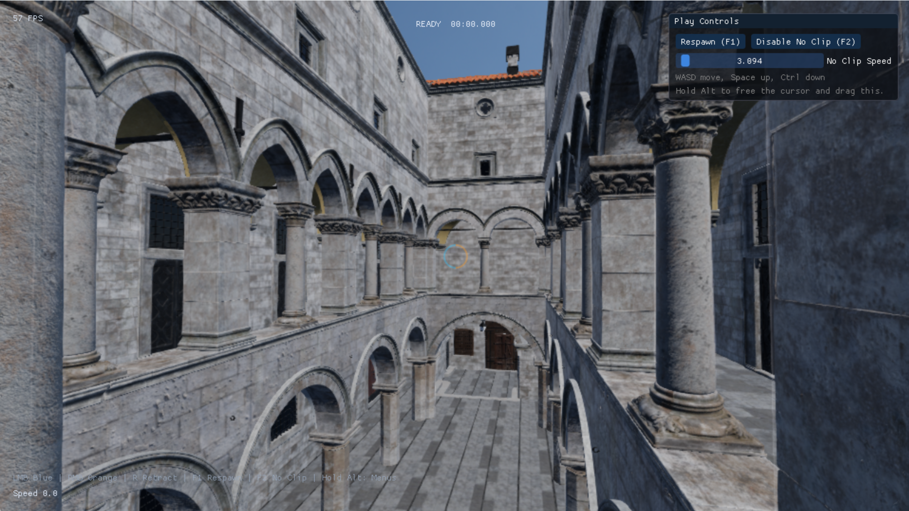
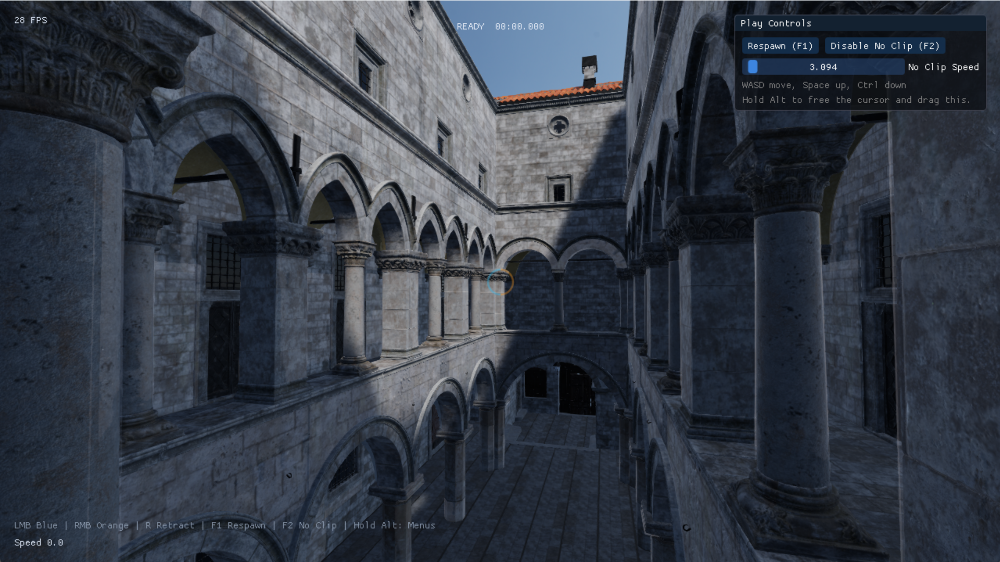
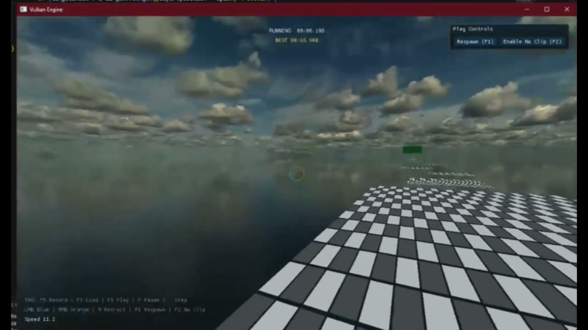

# Mirabilis

Mirabilis is a C++ Vulkan-based real-time engine prototype focused on editor-authored scenes, Source/Quake-style movement, and momentum-preserving linked portals.

[Watch the current milestone demo](https://kennynguyen216.github.io/portfolio/media/mirabilis-milestone2-demo.mp4) | [View my portfolio](https://kennynguyen216.github.io/portfolio/)

## Latest captures

### Real-time shadow pass

| Before | After |
| --- | --- |
|  |  |

[Watch before shadows](docs/media/mirabilis-before-shadows.mp4) · [Watch the shadow pass](docs/media/mirabilis-after-shadows.mp4)

### Timed movement course

[](docs/media/mirabilis-movement-time-trial.mp4)

Click the preview to watch the run.

## Highlights

### Vulkan rendering

- Renders GPU mesh and material pipelines with glTF/GLB scene loading.
- Manages Vulkan command buffers, synchronization, descriptor sets, dynamic rendering, and swapchain presentation.
- Includes a compute-rendered background and ongoing portal-rendering experiments.

### Linked portals

- Uses stencil-mask passes to restrict linked-world rendering to each visible portal surface.
- Includes an experimental recursive stencil path for a linked portal visible through another portal.
- Places portals on eligible walls, carves portal-shaped openings from collision, and rejects overlapping or invalid placements.
- Transforms player position, velocity, and view orientation through linked portal frames while preserving momentum.
- Keeps the player’s blue/orange portal-gun pair transient, while scene-authored freestanding portal links persist independently. Up to seven linked editor pairs can be placed and loaded per scene.

### Scene editor and tooling

- Provides an ImGui editor with a scene hierarchy, object inspector, selection, duplication, and deletion.
- Supports translate, rotate, and scale gizmos with optional snapping.
- Exposes editable box colliders and gameplay roles for scene-authored objects.
- Saves and loads scene hierarchies, transforms, collider data, imported assets, and actor roles as JSON.

### Movement and time trials

- Runs Source/Quake-inspired movement on a fixed timestep with acceleration, friction, air control, jump buffering, and bunny hopping.
- Supports surf ramps and scene-authored spawn points, start triggers, finish triggers, and a timer HUD.

## Technology

- **Language:** C++
- **Graphics:** Vulkan, GLSL
- **Platform and input:** SDL2
- **Editor UI:** ImGui and ImGuizmo
- **Assets and math:** fastgltf, simdjson, GLM, stb_image
- **Build:** CMake

SDL2, fmt, vk-bootstrap, VMA, GLM, ImGui, ImGuizmo, fastgltf, simdjson, and other supporting libraries are included under `third_party/`. Mirabilis uses these libraries as dependencies; the engine, renderer integration, editor systems, movement, collision, and portal features live in this project.

## Build and run

### Requirements

On Windows, install:

- Git
- CMake 3.8 or newer
- Visual Studio with the **Desktop development with C++** workload
- The [Vulkan SDK](https://vulkan.lunarg.com/sdk/home/)

The Vulkan SDK installer should configure the `VULKAN_SDK` environment variable. Restart your terminal after installing it.

### Clone

```powershell
git clone https://github.com/kennynguyen216/Mirabilis.git
cd Mirabilis
```

### Configure and build

```powershell
cmake -S . -B build
cmake --build build --config Debug --parallel
```

### Run

```powershell
Push-Location .\bin\Debug
.\engine.exe
Pop-Location
```

Press `Esc` or close the window to exit.

### Included bhop course

`assets/scenes/momentum_bhop_tutorial_adapted.json` is a native Mirabilis
adaptation of Momentum Mod's public `bhop_tutorial` source layout. Open it from
the editor's **File > Open Scene** menu. It progresses from wide, low pads to
tighter rising diagonal jumps and ends at a timed finish platform.

The original Source `.vmf`/`.bsp` cannot be loaded directly by Mirabilis, so
the course is rebuilt with the engine's own floor primitives, colliders, spawn,
and time-trial triggers. Source reference: https://github.com/momentum-mod/level-design

## Status

Ambient occlusion has a persistent **Globally Enabled** switch and quality/
blur preferences in Render Settings. These are saved in SDL's per-user
Mirabilis directory (`ambient_occlusion.cfg`) and shared by Debug and Release.
Loading a scene does not change them. Scenes without an `ssao` block use the
project defaults (radius 0.75, normal offset bias 0.075, intensity 1, power 1.5).
Enable **Override For This Scene** to edit and save level-specific values;
**Reset to Project Defaults** removes that override on the next scene save.
Existing scene `ssao` blocks remain explicit overrides.

SSAO coordinate reference checks can be run with:

```cmd
python -m unittest discover -s tests
```

These exercise odd render dimensions, reconstruction on grazing surfaces,
kernel rotation, and coplanar rejection. They complement GPU validation and
visual testing of Raw/Final AO on walls, corners, and narrow gaps.

Mirabilis is an active engine and rendering prototype. Features, controls, and scene formats may change as portal rendering, movement, and editor tooling evolve.

